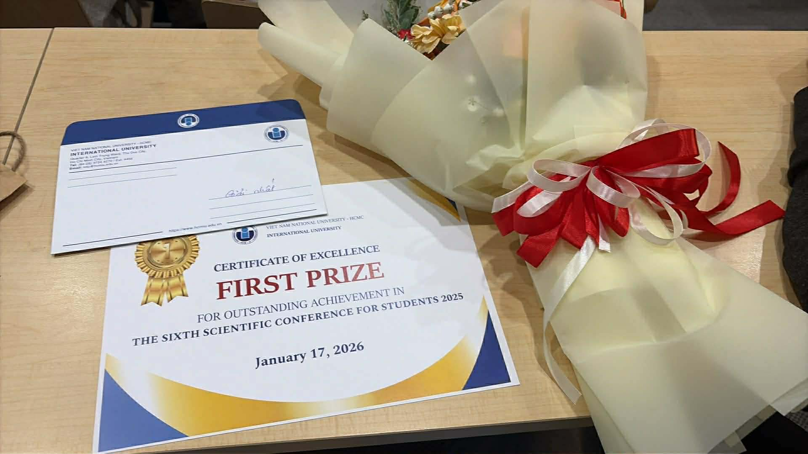

### GA-Optimized Quantum SVM (GA-QSVM)

This repository explores **Genetic Algorithm (GA)**–based synthesis of **quantum feature map circuits** for **Quantum Support Vector Machines (QSVM)**, applied to the German Credit dataset and the Wine dataset.  
It builds on a local copy of the `qoop` library to evolve parameterized quantum circuits that act as kernels for QSVC.

### From clumsy notebook to prize-winning project

The core ideas were first implemented rather “clumsily” in a single notebook, `testH.ipynb`, where:

- data preprocessing and PCA were prototyped,
- GA environments from `qoop` were wired to QSVC training,
- and early experiments were stored under the `result/` folder as `*.qpy` quantum circuits and JSON metadata.

That experimental pipeline was then refactored into a cleaner Python package structure under `src/` (dataset utilities, QSVM/SVM training helpers, GA optimization loops) with a reproducible runner script `run_testH.py`.  
This work earned **First Prize in the 6th Scientific Conference for Students of HCMIU** (see the conference overview at [HCMIU 6th Scientific Conference](https://ord.hcmiu.edu.vn/homepage/view/content?nid=210)), showcasing how hybrid quantum–classical workflows can be engineered starting from simple exploratory notebooks.

#### Prize photo



### Quantum circuit results

GA-optimized circuits are stored under `result/` as QPY objects and metadata, for example:

- `result/4qubits_Define_Eval_QSVC_2024-12-12/best_circuit.qpy`

You can load and visualize such a circuit with Qiskit:

```python
from qiskit import qpy

with open("result/4qubits_Define_Eval_QSVC_2024-12-12/best_circuit.qpy", "rb") as f:
    circuits = qpy.load(f)

qc = circuits[0]
print(qc.draw())
```

This circuit is then used as the feature map in a `QuantumKernel` for QSVC, and its performance is compared against standard feature maps (e.g., `ZFeatureMap`, `ZZFeatureMap`) and classical SVM baselines.

#### Example GA-evolved circuit (4 qubits)

Below is an example of a 4-qubit circuit found by the GA (text drawing from Qiskit):

```text
                                    ┌───┐      ┌──────────────┐     
q_0: ───────────────────────■───────┤ H ├──────┤ Rz(theta[3]) ├─────
                            │       └───┘      └──────────────┘     
q_1: ──────────────────■────┼────────────────────────────────────■──
     ┌──────────────┐┌─┴─┐  │  ┌──────────────┐┌──────────────┐  │  
q_2: ┤ Rz(theta[0]) ├┤ X ├──┼──┤ Rx(theta[1]) ├┤ Rz(theta[2]) ├──┼──
     └────┬───┬─────┘├───┤┌─┴─┐└──────────────┘└──────────────┘┌─┴─┐
q_3: ─────┤ H ├──────┤ H ├┤ X ├────────────────────────────────┤ X ├
          └───┘      └───┘└───┘                                └───┘
```

#### Why GA-evolved feature maps can outperform `ZFeatureMap` / `ZZFeatureMap` (and sometimes classical SVM)

In QSVM, the “model” is the **kernel** \(K(x, x')\), which is determined entirely by the feature map circuit. A GA-evolved circuit can help because it is **task-adaptive**, while standard feature maps are **fixed templates**:

- **Task-specific entanglement pattern**: `ZZFeatureMap` adds structured pairwise entanglement, and `ZFeatureMap` is mostly single-qubit phases. GA can place entangling gates and single-qubit rotations in a pattern that better matches the dataset’s correlations, which can improve class separation in the induced kernel space.
- **Richer, non-linear embedding at similar depth**: by mixing different rotation axes (`Rx`, `Rz`, etc.) with entanglers, the circuit can create a more expressive non-linear mapping than a single hand-designed template, without necessarily becoming much deeper.
- **Kernel geometry / alignment**: evolution directly optimizes the downstream accuracy, implicitly searching for circuits whose kernel matrix better aligns with the labels (higher same-class similarity, lower cross-class similarity).
- **Compared with classical RBF SVM**: an RBF kernel is strong and often wins; however, a good quantum feature map can sometimes provide a different inductive bias and similarity measure that fits certain structured correlations better. This is empirical (not guaranteed) and depends heavily on data preprocessing, feature dimension, circuit depth, and noise/simulator settings.

### Repository layout

- `src/`: refactored Python modules extracted from `testH.ipynb`
  - `datasets.py`: dataset loading, scaling, PCA + cached feature generation
  - `models.py`: QSVM and classical SVM training helpers
  - `ga_qsvm.py`: GA loops for optimizing QSVM on credit and wine datasets
  - `randomness.py`: seeding utilities for best-effort reproducibility
- `run_testH.py`: command-line runner that executes the GA+QSVM pipeline
- `testH.ipynb`: original exploratory notebook that motivated this refactor
- `test.ipynb`: additional experiments and earlier GA/QSVM tests
- `germancredit_data_updated.csv`: preprocessed German credit dataset
- `result/`: experiment outputs (GA-evolved circuits in QPY, JSON metadata)
- `qoop/`: vendored quantum object optimizer library used by the GA pipeline
- `docs/`: additional documentation (setup, pipeline details, troubleshooting)

### Installation

From the repository root:

```bash
python -m pip install -r requirements.txt
```

This installs:

- scientific stack: `numpy`, `pandas`, `scikit-learn`, `matplotlib`, `tqdm`
- quantum stack: `qiskit`, `qiskit-aer`, `qiskit-machine-learning`

> On Windows/conda, using a fresh environment is recommended before installing.

### Running the GA+QSVM pipeline

To reproduce the main GA+QSVM experiments as a script (instead of the notebook):

```bash
python run_testH.py --dataset credit
```

For the wine dataset:

```bash
python run_testH.py --dataset wine
```

For additional flags and help:

```bash
python run_testH.py --help
```

The script prints a list of best accuracies across feature dimensions, similar to what is recorded in the final cells of `testH.ipynb`.

### More information

For more detailed documentation, see the files under `docs/`:

- `docs/getting-started.md`: environment setup and sanity checks
- `docs/pipeline-testH.md`: explanation of the refactored pipeline
- `docs/repo-structure.md`: overview of folders and their roles
- `docs/troubleshooting.md`: common errors and how to fix them


